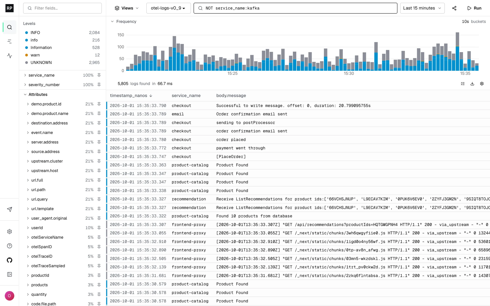
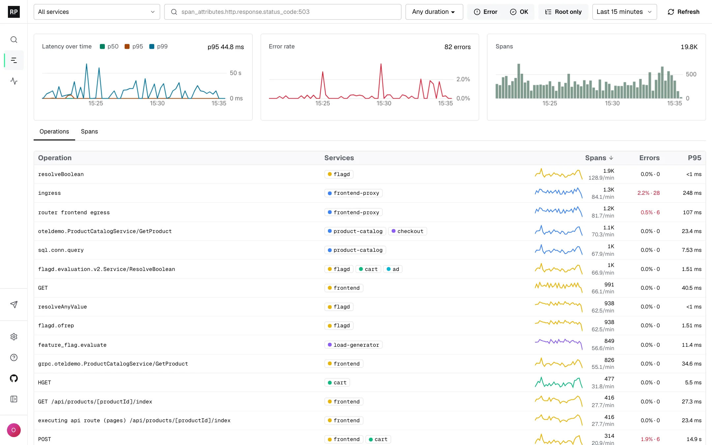
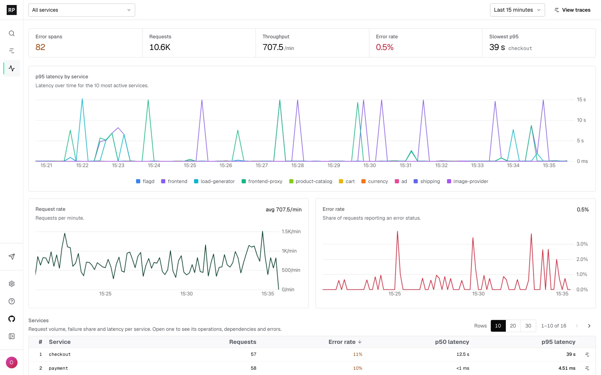

# Rootprint

[](#)
[](#)
[](#)
[](#)
[](https://github.com/rootprint/rootprint/releases)
[](LICENSE)

### [Live demo](https://demo.rootprint.io) &nbsp;·&nbsp; [Quick start](#quick-start) &nbsp;·&nbsp; [Docs](https://docs.rootprint.io) &nbsp;·&nbsp; [Contributing](CONTRIBUTING.md) &nbsp;·&nbsp; [Changelog](CHANGELOG.md)

Open-source, self-hosted logs and traces with full-text search directly on S3-compatible object storage.

Rootprint is open-source log and trace search that runs on your own object storage. Built on
Quickwit, it indexes the full text of every log, so you can find any line without designing labels
first. Indexes live in your S3, GCS, R2, MinIO or Azure Blob bucket, so a year of retention costs a
year of storage. Send data over OpenTelemetry, open a trace from any log, and see request rate,
errors and p95 latency for every service.

> [!TIP]
> **Try it now at [demo.rootprint.io](https://demo.rootprint.io)** - live OpenTelemetry logs and
> traces from a running demo cluster.

[](https://demo.rootprint.io)

## What You Get

- **Find any line** - Every word of every log is indexed, so you can search without knowing the
  service, stream or label. Save views, share links, and export to NDJSON, CSV or text.
- **Your bucket is the database** - Indexes live in your S3, GCS, R2, MinIO or Azure Blob bucket,
  and the whole stack is three containers: Rootprint, Quickwit and Postgres.
- **Logs and traces, one place** - Open a trace from any log, and the logs behind any span.
- **OpenTelemetry ingestion** - OTLP from any collector or SDK, plus NDJSON, Kafka, Kinesis and SQS.
- **Team access** - Roles, scoped API keys, and sign-in with Google, GitHub or OpenID Connect.
- **Admin controls** - Manage indexes, sources, field configuration and activity.
- **Apache-2.0** licensed.

## Traces

Search spans across every trace by service, operation, duration and status, and chart their volume,
error rate and latency. Open any trace as a waterfall, and jump from a span to the logs it produced.

[](https://demo.rootprint.io)

Learn more: [Trace explorer](https://docs.rootprint.io/traces/search) ·
[Read a trace](https://docs.rootprint.io/traces/explore)

## Services

Request rate, error rate and p95 latency for every service, built from the spans you already send.
Open a service to see its operations, dependencies and errors.

[](https://demo.rootprint.io)

Learn more: [Service health](https://docs.rootprint.io/traces/services)

## Quick Start

```bash
curl -o docker-compose.yml https://docs.rootprint.io/files/docker-compose.full.yaml
docker compose up -d
```

Open http://localhost:8282, then:

1. Create the first admin account.
2. Open **Send data** and follow the guide for your source. Its first step creates your ingest key.
3. Search your logs in **Logs** and your spans in **Traces**.

Full install guide: https://docs.rootprint.io/install/docker-compose

## Documentation

- [Quickstart](https://docs.rootprint.io/quickstart)
- [Send logs](https://docs.rootprint.io/send-logs/overview)
- [Send traces](https://docs.rootprint.io/traces/send)
- [Query syntax](https://docs.rootprint.io/search/query-language)
- [Configuration](https://docs.rootprint.io/configuration/environment-variables)
- [API reference](https://docs.rootprint.io/api/overview)

## Contributing

See [CONTRIBUTING.md](CONTRIBUTING.md) for local setup, the repository layout and the checks to run
before opening a pull request.

## Status

Rootprint is under active development and has not reached 1.0. See [CHANGELOG.md](CHANGELOG.md).

## License

Apache-2.0. See [LICENSE](LICENSE).
